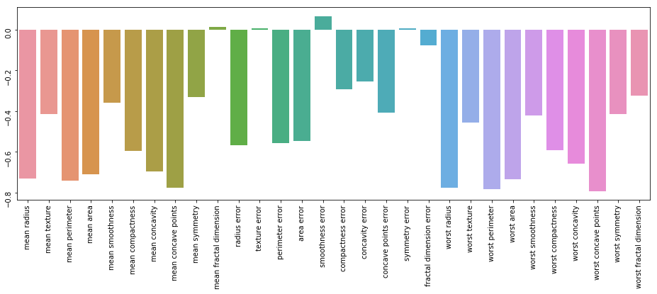
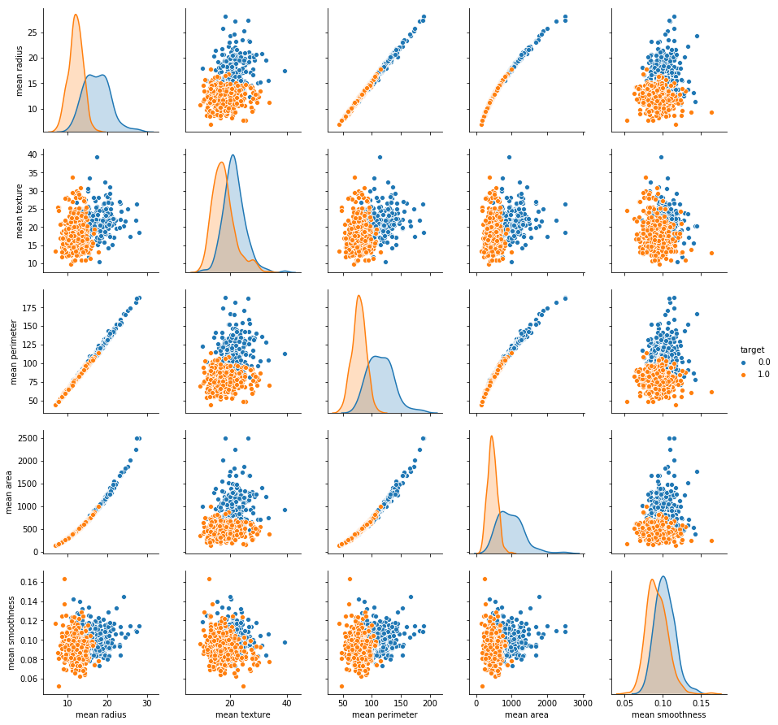

# Breast-Cancer-Detection-App : Project Overview
 Simple App which can detect Weather they have Cancer or not depending up on users data provided to the application.
 * Created an app that detects wheather they have Cancer or not to help doctors with 98% accuracy .
 * Data collected from Open source websites from Internet .
 * Processed features to make data look's like perfect and to get good accuracy with less loss
 * I had used Ada boost Classifier ,XGBoost ,Logistic ,support vector to reach best model
 * Deployed model on Heroku .
## Code and Resources Used :
* Python Version : 3.7
* Packages: pandas, numpy, sklearn, matplotlib, seaborn, selenium, flask, json, pickle
* For Web Framework Requirements: `pip install -r requirements.txt`
## Data Cleaning :
 Data look's perfect and there is no null data present in this data set .
## EDA :
I looked at the distributions of the data and the value counts for the various categorical variables.

