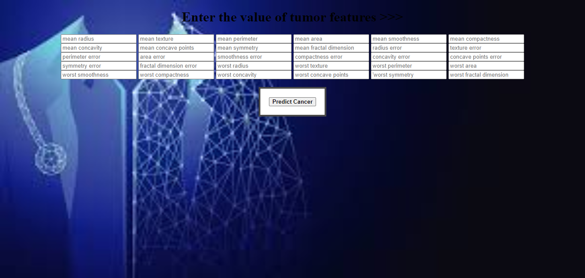

# Breast-Cancer-Detection-App : Project Overview

 Simple App which can detect Weather they have Cancer or not depending up on users data provided to the application.
 * Created an app that detects wheather they have Cancer or not to help doctors with 98% accuracy .
 * Data collected from Open source websites from Internet .
 * Processed features to make data look's like perfect and to get good accuracy with less loss
 * I had used Ada boost Classifier ,XGBoost ,Logistic ,support vector to reach best model
 * Deployed model on Heroku .
## Code and Resources Used :
* Python Version : 3.7
* Packages: pandas, numpy, sklearn, matplotlib, seaborn, selenium, flask, json, pickle
* For Web Framework Requirements: `pip install -r requirements.txt`
## Data Cleaning :
 Data look's perfect and there is no null data present in this data set .
## EDA :
I looked at the distributions of the data and the value counts for the various categorical variables.

## Model Building :
 First, I transformed the categorical variables into dummy variables. I also split the data into train and tests sets with a test size of 20%.  
 I tried three different models and evaluated them using Classification Metrics. I chose Confusion Matrix Because it's better to understand how many features are going to support and not going to support . 
 I tried Five different models:
* Support Vector Classifier: It classifies data perfectly 
* Logistic Regression
* K-Nearest Neighbour Classifier
* Naive Bayes Classifier
* XGBoost Classifier
## Model Performance :
The XGBoost model far outperformed the other approaches on the test and validation sets.
* XGBoost Classifier : Accuracy = 97
* Support Vector Classifier : Accuracy =96
* Logistic Regression : 95
* Decision Tree Classifier : 94
## Productionization :
In this step , I had deployed Model on heroku with Flask api.
